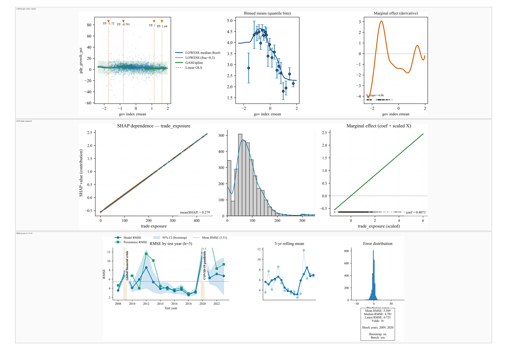

# Reproducible AI Infrastructure for High-Dimensional Modeling

## A Hybrid Machine Learning–Econometrics System for Macroeconomic Forecasting and Structural Diagnostics

## Abstract

This project presents a reproducible research infrastructure for high-dimensional empirical modeling, using macroeconomic panel data as a stress-testing domain rather than as an end in itself. The system integrates econometric structure with machine learning regularization to evaluate whether well-established macroeconomic relationships remain stable under modern high-dimensional modeling and forecasting settings.

The pipeline combines fixed-effects estimation, regularized regression, and a structured diagnostic layer to support both temporal forecasting and structural examination. Forecast performance is evaluated under rolling (recursive) forecast validation at multiple horizons, while interpretability and robustness are assessed through complementary diagnostic techniques. All experiments are executed within a deterministic, containerized environment that regenerates a canonical baseline of figures, reports, and metadata from an explicit configuration.

The primary contribution of this work lies in the design and execution of a disciplined, end-to-end infrastructure that emphasizes reproducibility, diagnostic transparency, and methodological triangulation, demonstrating how traditional economic relationships can be evaluated as stability benchmarks within modern empirical modeling systems.

  

## Contributions

This repository documents the following technical and methodological contributions:

* A reproducible, end-to-end research infrastructure for high-dimensional empirical modeling, designed to regenerate a canonical experimental baseline from an explicit configuration in a deterministic, containerized environment.

* An integrated modeling framework that combines fixed-effects econometric structure with regularized machine learning to support both temporal forecasting and structural diagnostic analysis on large macroeconomic panel data.

* A unified diagnostic layer incorporating methodological triangulation, effect parity checks, interpretability analysis, and forecast comparison to assess the stability of established economic relationships under modern modeling settings.

* A curated artifact set—including a one-page summary, baseline snapshot, and structured diagnostic reports—that exposes results, assumptions, and evaluation behavior transparently rather than as opaque model outputs.

## Non-Claims and Scope Limits

This work is intentionally scoped as an empirical and infrastructural evaluation, not as a source of new economic theory or policy prescription.

In particular, the project does not claim causal identification, structural parameter estimation, or policy attribution. All analyses are conducted on observational macroeconomic panel data and are interpreted as descriptive, predictive, or diagnostic in nature rather than as causal evidence.

Macroeconomic theory is used as a stability benchmark within the modeling pipeline: established relationships are evaluated for consistency and robustness under high-dimensional regularization and temporal forecasting settings, not as proofs of underlying economic mechanisms.

The system is designed to assess reproducibility, diagnostic transparency, and methodological behavior under realistic data constraints. Questions of institutional specificity, country-level policy design, or counterfactual intervention analysis are explicitly outside the scope of this work.

## Methodological Overview

The project is organized as a structured, end-to-end empirical pipeline designed to support reproducible modeling, diagnostic evaluation, and temporal forecasting on high-dimensional macroeconomic panel data.

**Data ingestion and preparation** standardize raw macroeconomic indicators across countries and years, enforce consistent panel alignment, and apply controlled transformations to support comparability over time. Feature construction is explicitly logged, schema-locked, and versioned to ensure traceability across experimental runs.

**Modeling** is conducted using a combination of econometric and machine learning approaches. Fixed-effects estimators provide structural control for unobserved heterogeneity across countries, while regularized regression is used to manage high-dimensional feature spaces and multicollinearity. These components are treated as complementary rather than competing methodologies.

**Evaluation and diagnostics** are applied uniformly across model families. Forecast performance is assessed using rolling (recursive) forecast validation at multiple horizons, while structural behavior and stability are examined through interpretability and robustness diagnostics. This layered evaluation framework is intended to expose not only predictive accuracy, but also model sensitivity and consistency across estimation strategies.

**Execution and artifact generation** are fully automated within a deterministic containerized environment. Each run regenerates a canonical set of figures, reports, and metadata from an explicit configuration, enabling consistent comparison and inspection across experiments.

## Models and Diagnostics Used

The pipeline implements a defined set of model families and diagnostic tools, applied consistently across experiments to support comparative evaluation and interpretability.

### Model families

* Ordinary Least Squares (OLS) as a transparent baseline.
* Fixed-effects (within) estimators to control for unobserved country-specific heterogeneity.
* ElasticNet regression to manage high-dimensional feature spaces with correlated predictors through combined L1/L2 regularization.

### Forecast evaluation

* Rolling (recursive) forecast evaluation with model re-estimation at each step.
* Forecast horizons evaluated at h = 1 and h = 3.
* Root Mean Squared Error (RMSE) as the primary accuracy metric.
* Rolling-origin comparison against simple persistence benchmarks.

### Structural and diagnostic analysis

* Methodological triangulation and effect parity checks across model families.
* SHAP-based interpretability analysis for regularized models.
* LOWESS smoothing and GAM-based diagnostics to assess non-linear relationships.
* Multicollinearity diagnostics and residual analysis for model validity checks.
* Temporal stability diagnostics to evaluate behavior across economic regimes.

## Reproducibility and Execution Guarantees

All experiments in this project are executed within a gated, deterministic, containerized environment to ensure reproducibility and traceability of results.

* All data transformations and features are schema-locked.
* Minimum sample integrity and predictor coverage conditions are enforced prior to model training.
* The pipeline halts explicitly on invariant violations; no silent fallbacks occur.
* A canonical baseline snapshot aggregates coefficients, diagnostics, interpretability outputs, and provenance into a single auditable state.
* All generated artifacts include checksums and metadata for independent verification.

Execution is intentionally non-interactive. The pipeline runs to completion, regenerates a fixed set of outputs corresponding to the baseline configuration, and exits automatically.

While a finalized dataset is included for inspection, the recommended workflow is to regenerate all artifacts by running the pipeline within the containerized environment.

## Artifacts and Outputs

The pipeline produces a curated set of artifacts representing the canonical experimental state.

### Canonical snapshots

* Deterministic baseline snapshot (JSON, tables, and metadata)
* Model comparison tables
* Provenance manifests

### Diagnostics and robustness

* Fixed-effects diagnostics
* Rolling forecast validation reports
* Robustness summaries and influence diagnostics
* Predictor coverage and stability reports

### Interpretability and visualization

* SHAP summaries and dependence plots
* LOWESS and GAM-based nonlinear diagnostics
* ElasticNet coefficient paths
* Comparative effect forest plots
* One-page synthesis figures

Intermediate serialized artifacts are retained for completeness but are not required for inspection or reproduction of reported results.

## Data Card

**Data sources.**
Publicly available macroeconomic indicators aggregated at the country–year level, selected to support cross-country comparability and longitudinal analysis rather than country-specific institutional inference.

**Coverage.**

* Geographic scope: Global coverage across 100+ countries
* Temporal scope: 2000–2022
* Unit of observation: Country–year

**Core variables.**

* `gdp_growth_pct`: Annual real GDP growth (percent), treated as the primary observed outcome variable.
* `inflation_consumer_prices_pct`: Annual consumer price inflation (percent).
* `trade_exposure`: Trade openness as a percentage of GDP.
* `gov_index_zmean`: Composite governance quality score constructed from z-standardized Worldwide Governance Indicators (WGI) components.

**Missingness and preprocessing.**
Missing values are handled through controlled filtering, imputation rules, and alignment procedures documented in the pipeline. All preprocessing operations are logged and versioned.

**Known limitations.**
The data are observational, aggregated, and subject to reporting differences and revision effects across countries and years. These limitations motivate the project’s emphasis on reproducibility, diagnostic stability, and comparative evaluation rather than causal interpretation.

## Model Card

**Model families.**

* Ordinary Least Squares (OLS)
* Fixed-effects (within) estimators
* ElasticNet regression

**Training and evaluation protocol.**
Models are re-estimated under rolling (recursive) forecast validation at horizons h = 1 and h = 3, with performance assessed using RMSE.

**Intended use.**
Empirical stress-testing of established macroeconomic relationships, diagnostic inspection, and comparative forecasting within a reproducible research setting.

**Out-of-scope use.**
Causal inference, policy design, real-time decision-making, or country-specific institutional analysis.

**Failure modes and limitations.**
Performance may degrade under structural breaks or data revisions. Regularization may attenuate weak signals, and fixed-effects specifications abstract from time-invariant cross-country differences. These behaviors are examined through diagnostics rather than obscured.

Additional negative and neutral findings are documented in `docs/negative_results.md`.

## Research Paper

A methodological paper documenting the design, execution, and evaluation of this research infrastructure has been prepared and submitted.

* **SSRN:** Under review (Abstract ID: 5930082)
* **arXiv:** Planned following SSRN processing

Persistent links will be added once public.

## Repository Structure

.
├── src/                # Data preparation, modeling, and diagnostics
├── scripts/            # Entry-point and orchestration scripts
├── config/             # Explicit JSON configurations
├── reports/            # Generated figures, diagnostics, and summaries
│   ├── onepager/
│   ├── snapshots/
│   └── diagnostics/
├── artifacts/          # Serialized intermediate outputs
├── Dockerfile
├── docker-compose.yml
└── README.md

## License and Citation

* **License:** MIT License

If you use or reference this work, please cite the accompanying paper. Citation metadata is provided in `CITATION.cff`.
